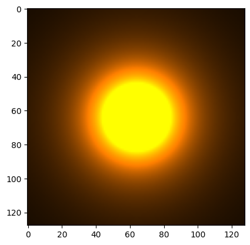

# glslike


## Getting started

```cpp
#include "glslike.hpp"
#include "glslike_io.hpp"

using namespace glslike;


vec3 calc(vec2 position) {
    float distance = length(position);
    float distanceSqrd = distance * distance;
    return vec3(
        0.2f / distanceSqrd,
        0.1f / distanceSqrd,
        0.0f
    );
}

std::uint8_t to256(float value) {
    return static_cast<std::uint8_t>(std::clamp(value, 0.0f, 1.0f) * 255.0f);
}

int main() {
    constexpr int size = 1024;
    constexpr float half = size / 2.0f;
    std::vector<std::uint8_t> data(size * size * 4);
    constexpr int row_size = size * 4;
    for (int y = 0; y < size; ++y) {
        const int offset0 = y * row_size;
        for (int x = 0; x < size; ++x) {
            const int offset = offset0 + x * 4;
            // create vector
            auto vx = (x - half) / half;
            auto vy = (y - half) / half;
            vec2 position(vx, vy);

            // calc color
            auto c = calc(position);

            // write color
            data[offset + 0] = to256(c.r);
            data[offset + 1] = to256(c.g);
            data[offset + 2] = to256(c.b);
            data[offset + 3] = 0xff;
        }
    }

    glslike::io::rgba2png("output.png", data, size, size, 4);

    return 0;
}
```


## Use in Halide

```cpp
#define GLSLIKE_USE_HALIDE
#include "glslike.hpp"
#include "glslike_io.hpp"

using namespace glslike;


vec3 calc(vec2 position) {
    Halide::Expr distance = length(position);
    Halide::Expr distanceSqrd = distance * distance;
    return vec3(
        0.2f / distanceSqrd,
        0.1f / distanceSqrd,
        0.0f
    );
}

Halide::Expr to256(Halide::Expr value) {
    return Halide::cast<std::uint8_t>(clamp(value, 0.0f, 1.0f) * 255.0f);
}


class GettingStartedHalide : public Halide::Generator<GettingStartedHalide> {
public:
    Halide::GeneratorOutput<Halide::Buffer<std::uint8_t>> output{"output", 3};
    Halide::Var x{"x"}, y{"y"}, c{"c"};

    void generate() {
        // Unhandled exception: Error: Can't access output buffer of undefined Func.
        // see: https://github.com/halide/Halide/issues/6586
        output(c, x, y) = Halide::cast<std::uint8_t>(0);

        const auto width = output.dim(1).extent();
        const auto height = output.dim(2).extent();
        const auto half_width = width / 2.0f;
        const auto half_height = height / 2.0f;

        // create vector
        const auto vx = (x - half_width) / half_width;
        const auto vy = (y - half_height) / half_height;
        const vec2 position(vx, vy);

        // calc color
        const auto color = calc(position);

        // write color
        output(0, x, y) = to256(color.r);
        output(1, x, y) = to256(color.g);
        output(2, x, y) = to256(color.b);
        output(3, x, y) = Halide::cast<std::uint8_t>(0xff);
    }

    void schedule() {
        output.set_estimates({{0, 3}, {0, 1024}, {0, 1024}});
    }
};

HALIDE_REGISTER_GENERATOR(GettingStartedHalide, getting_started_halide)
```

## Swizzling

```cpp
vec3 v(1.0f, 2.0f, 3.0f);
vec3 rgb = v.rgb;
EXPECT_EQ(rgb.r, 1.0f);
EXPECT_EQ(rgb.g, 2.0f);
EXPECT_EQ(rgb.b, 3.0f);
vec3 bgr = v.bgr;
EXPECT_EQ(bgr.r, 3.0f);
EXPECT_EQ(bgr.g, 2.0f);
EXPECT_EQ(bgr.b, 1.0f);
```

## Python Interface

```python3
>>> from glslike import *
>>> v = vec3(1.0, 2.0, 3.0)
>>> v
vec3(1.0, 2.0, 3.0)
>>> v.bgr
vec3(3.0, 2.0, 1.0)
>>> m = mat3()
>>> m * v
vec3(1.0, 2.0, 3.0)
>>> v * m
Traceback (most recent call last):
  File "<stdin>", line 1, in <module>
TypeError: __mul__(): incompatible function arguments. The following argument types are supported:
    1. (self: glslike.__glslike.vec3, arg0: float) -> glslike.__glslike.vec3
    2. (self: glslike.__glslike.vec3, arg0: glslike.__glslike.vec3) -> glslike.__glslike.vec3

Invoked with: vec3(1.0, 2.0, 3.0), mat3(1.0, 0.0, 0.0, 0.0, 1.0, 0.0, 0.0, 0.0, 1.0)
```

## Jupyter Notebook

```python
import matplotlib.pyplot as plt
from glslike import *

def calc(position):
    distance = length(position)
    if distance == 0:
        return vec3(1.0, 1.0, 0.0)
    distanceSqrd = distance * distance
    return vec3(
        0.2f / distanceSqrd,
        0.1f / distanceSqrd,
        0.0f
    )

plt.imshow(realize3(calc, 128))
```


