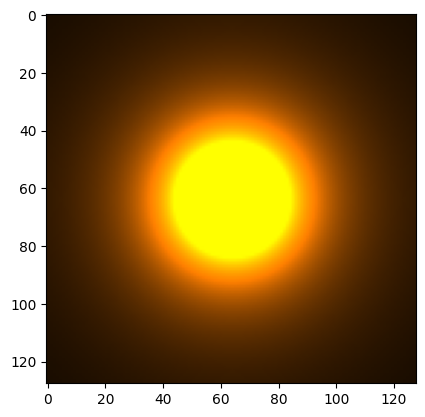

# glslike-python


### Requirements

* [pybind11](https://github.com/pybind/pybind11)
* [libpng](http://www.libpng.org/pub/png/libpng.html)


## Installation

```bash
python3 -m venv .venv
source .venv/bin/activate
pip install -r requirements.txt
python setup.py build
```


## Usage

```python3
>>> from glslike import *
>>> v = vec3(1.0, 2.0, 3.0)
>>> v
<vec3: (1.000000e+00, 2.000000e+00, 3.000000e+00)>
>>> v.bgr
<vec3: (3.000000e+00, 2.000000e+00, 1.000000e+00)>
>>> m = mat3()
>>> m * v
<vec3: (1.000000e+00, 2.000000e+00, 3.000000e+00)>
>>> v * m
Traceback (most recent call last):
  File "<stdin>", line 1, in <module>
TypeError: __mul__(): incompatible function arguments. The following argument types are supported:
    1. (self: glslike.__glslike.vec3, arg0: float) -> glslike.__glslike.vec3
    2. (self: glslike.__glslike.vec3, arg0: glslike.__glslike.vec3) -> glslike.__glslike.vec3

Invoked with: <vec3: (1.000000e+00, 2.000000e+00, 3.000000e+00)>, <mat3: (1.000000e+00, 0.000000e+00, 0.000000e+00, 0.000000e+00, 1.000000e+00, 0.000000e+00, 0.000000e+00, 0.000000e+00, 1.000000e+00)>
```

## Jupyter Notebook

```
import matplotlib.pyplot as plt
from glslike import *

def calc(position):
    distance = length(position)
    if distance == 0:
        return vec3(1.0, 1.0, 0.0)
    distanceSqrd = distance * distance
    return vec3(
        0.2f / distanceSqrd,
        0.1f / distanceSqrd,
        0.0f
    )

plt.imshow(realize3(calc), 128)
```


